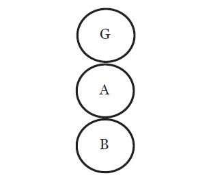

# Comunicazione e stati dell’io

L’Analisi Transazionale è una corrente psicoterapeutica creata dallo psicologo americano Eric Berne, alla cui base c’è la distinzione tra tre stati dell’io: Genitore, Adulto e Bambino. Uno stato dell’io è un insieme coerente di sentimenti, cui corrisponde un insieme di comportamenti. In altri termini, noi abbiamo di volta in volta, nelle diverse situazioni della nostra vita, sentimenti da bambino, da adulto e da genitore, e ci comportiamo di conseguenza. Siamo nello stato dell’io Genitore quando ci comportiamo come si sarebbero comportati i nostri genitori, dell’Adulto quando valutiamo una situazione in modo oggettivo, affrontiamo razionalmente i problemi e siamo concentrati sul qui ed ora, e del Bambino quando, pur essendo adulti, reagiamo come avremmo fatto da bambini, quando siamo creativi, spontanei, tesi al divertimento ed alla gioia. 

La personalità di un uomo e di una donna si può rappresentare quindi con il seguente diagramma strutturale (dove G sta per Genitore, A per Adulto e B per Bambino). 

Questo diagramma rende molto più complessa la considerazione della situazione dalla quale siamo partiti (due persone che comunicano). La comunicazione, infatti, non è più soltanto tra persone, ma tra stati dell’io. Quando ci rivolgiamo a qualcuno, possiamo farlo trovandoci nello stato del Genitore, dell’Adulto o del Bambino. Se chiedo una semplice informazione, sono nello stato dell’Adulto, se faccio un rimprovero sono in quello del Genitore, se propongo un gioco o mi lamento in quello del Bambino. Non solo. Ogni nostra comunicazione – che nel linguaggio dell’Analisi Transazionale si chiama stimolo transazionale – può essere rivolta al Genitore, all’Adulto o al Bambino dell’altro. Nel momento in cui l’altro risponde (la risposta si chiama reazione transazionale) possono succedere due cose: a rispondere può essere lo stesso stato dell’io cui mi sono rivolto con la mia domanda, oppure uno stato diverso. Se lo stato dell’io è lo stesso, si parla di transazione complementare, semplificata dal diagramma che segue: 

Abbiamo qui uno stimolo transazionale da Genitore a Bambino cui risponde una reazione transazionale da Bambino a Genitore; uno stimolo transazionale da Adulto ad Adulto, cui risponde una reazione transazionale da Adulto ad Adulto; uno stimolo transazionale da Bambino a Genitore, cui risponde una reazione transazionale da Genitore a Bambino. Si tratta di situazioni piuttosto comuni, nei quali i comunicanti provano una sensazione di soddisfazione ed armonia, perché c’è corrispondenza tra ciò che l’uno chiede e ciò che l’altro offre. Questa situazione si chiama transazione complementare, ed è una transazione (cioè uno scambio comunicativo) che procede senza ostacoli, e si interrompe solo per interventi esterni (ad esempio perché è tardi ed uno dei due comunicanti deve andare, o perché interviene una terza persona). 

Diverso è il caso di una transazione incrociata. Essa si ha quando ad uno stimolo transazionale si risponde con una reazione transazionale che non proviene dallo stato dell’io cui era rivolto lo stimolo. Lo schema seguente mostra una transazione incrociata. 

Come si vede, in questo caso le linee non procedono parallele, ma si incrociano. Una semplice richiesta da Adulto ad Adulto ha provocato una risposta da Bambino a Genitore. Ad esempio, il soggetto A ha chiesto una informazione, ed il soggetto B ha risposto come se quella domanda contenesse una critica. Come si può intuire, queste transazioni sono molto meno facili delle transazioni complementari. Se le prime procedono virtualmente all’infinito, le transazioni incrociate rappresentano un inciampo nella comunicazione, cui può seguire il silenzio oppure una transazione complementare (nel caso dell’esempio, potrebbe seguire una transazione complementare tra Genitore e Bambino). Questo genere di transazioni abbondano nelle relazioni tra persone che non si comprendono i cui scambi comunicativi lasciano una sensazione di fastidio, a volte anche di rabbia. Un terzo, importante genere di transazione è la transazione ulteriore. Nelle transazioni che abbiamo visto, interviene uno stato dell’io alla volta; in quelle ulteriori, gli stati dell’io che intervengono sono due. Queste transazioni, cioè, contengono un messaggio evidente ed un altro nascosto, si rivolgono in modo palese ad uno stato dell’io ed in modo occulto ad un altro. Semplifichiamo ancora con uno schema. 

Qui abbiamo uno scambio comunicativo evidente tra Adulto ed Adulto, ed uno scambio contemporaneo tra Adulto e Bambino. Eric Berne illustra questa situazione con l’esempio di uno scambio di battute tra un commesso ed una casalinga. Il commesso sa che per vendere il suo aspirapolvere deve far leva sulla parte infantile della personalità delle sue clienti (strategia ampiamente sfruttata dai pubblicitari, come vedremo). Per questo mostra alla casalinga l’aspirapolvere più costoso, ed osserva: "Questo sarebbe il migliore, ma lei non se lo può permettere". Apparentemente, questa è una osservazione oggettiva: l’aspirapolvere costa realmente molto, ed evidentemente la casalinga non mostra di essere ricca. Si tratta di una transazione da Adulto ad Adulto. Ma l’osservazione contiene anche una provocazione ed una sfida rivolta alla parte meno razionale della casalinga, che infatti risponde: "E invece lo prendo". Le transazioni ulteriori, che costituiscono la parte più intrigante dei nostri scambi comunicativi, sono transazioni nelle quali l’aspetto di contenuto e l’aspetto di relazione di una comunicazione, individuati dal secondo assioma della pragmatica della comunicazione, si distinguono per il fatto di essere indirizzati ad aspetti differenti della personalità dell’interlocutore.

## Bibliografia

E.Berne, *A che gioco giochiamo*, Bompiani, Milano 2003.

Testo di Antonio Vigilante. Licenza CC BY 4.0 International.
